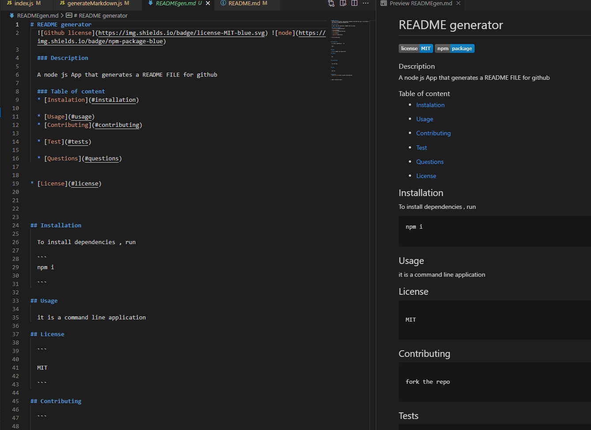

# README generator
   
  
  ### Description

  A node js App that generates a README FILE for github

  ## Image of generated README 



  ### Table of content
  * [Instalation](#installation)

  * [Usage](#usage)
  * [Contributing](#contributing)

  * [Test](#tests)

  * [Questions](#questions)

  
* [License](#license)


 
  
## Installation
   
  To install dependencies , run   

  ```
  npm i

  ```

## Usage 

  it is a command line application

## License

  ```

  MIT

  ```

## Contributing

  ```

  fork the repo 

  ```

## Tests 

  ```

  npm test

  ```

## Questions 
  [Github profile](https://github.com/kifeakor22)

  ```


* [Email me](mailto:email)


  ```

